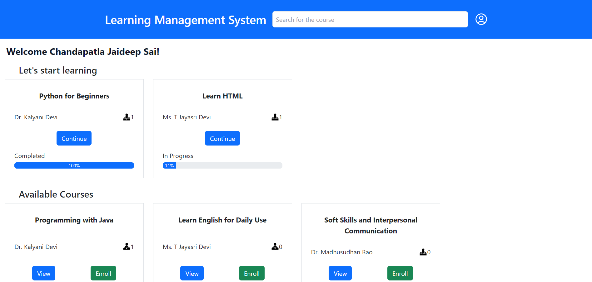
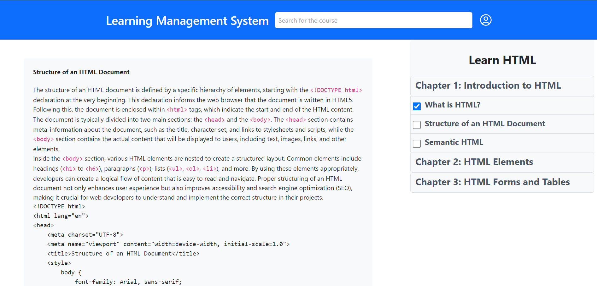
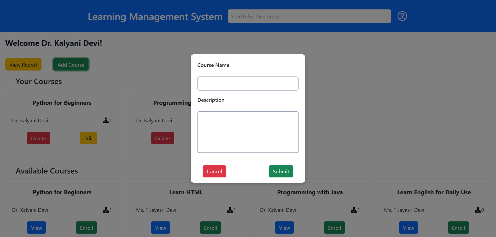
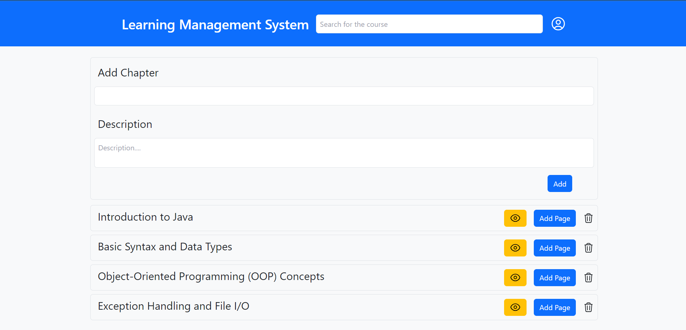
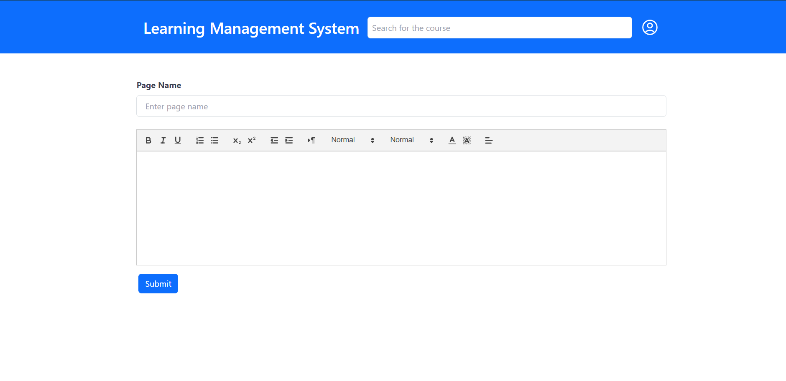

# Learning Management System (LMS)

A web-based Learning Management System (LMS) that enables faculty to create and manage courses, and allows students to enroll in courses, track progress, and access course content. This project includes features for both faculty and students, with user-friendly dashboards, course chapters, and enrollment management.

## Features

- **Faculty Features**:
  - Create, update, and manage courses
  - Add multiple chapters to courses
  - Add multiple pages to chapters
  - View reports on student enrollment and completion

- **Student Features**:
  - Browse and enroll in available courses
  - Preview of chapters without enrolling courses
  - Track course progress by marking pages as complete
  - View a list of enrolled courses and completed courses
  - Track course completion progress in percentage

- **Features common for both Student and Faculty Account**:
  - Browse all the course details using search functionality
  - Change your password
  - View user profile details
  - Signout

- **Authentication**:
  - Secure user authentication for both faculty and students
  - Sign up and sign in functionality

- **Database**:
  - PostgreSQL database 

## Tech Stack

- **Backend**: Node.js, Express.js
- **Database**: PostgreSQL, Sequelize ORM
- **Frontend**: HTML, CSS (Bootstrap, Tailwind), JavaScript (Fetch API)
- **Templating Engine**: EJS (Embedded JavaScript Templates)
- **Authentication**: Passport.js, bcrypt.js for password hashing
- **Deployment**: Render

## Screenshots

### Home Page



### Course Details Page



### Add new Course



### Add new Chapter



### Add new Page



---

## Installation

To run the project locally, follow these steps:

1. **Clone the repository**:

   ```bash
   git clone https://github.com/Jaideep-iare/Learning-Management-System.git
2. **Navigate into the project directory**:

   ```bash
   cd Learning-Management-System
3. **Install dependencies**:
    
    Ensure you have Node.js and npm installed. Then run the following command:
   ```bash
   npm install
4. **Set up PostgreSQL database**:
- Install PostgreSQL
- Create a new PostgreSQL database

This project uses a `config.js` file located in the `config` directory for managing environment settings such as database credentials and other configurations.

#### Example `config/config.js` file:

```javascript
{
  development: {
    username: "your_db_username",
    password: "your_db_password",
    database: "your_db_name",
    host: "127.0.0.1",
    dialect: "postgres"
  },
  "test": {
    username: "your_db_username",
    password: "your_db_password",
    database: "your_db_name",
    host: "127.0.0.1",
    dialect: "postgres"
  },
  production: {
    username: process.env.DB_USERNAME,
    password: process.env.DB_PASSWORD,
    database: process.env.DB_NAME,
    host: process.env.DB_HOST,
    dialect: "postgres"
  }
};
```
5. **Migrate the database**:

    Use Sequelize to create necessary tables:

   ```bash
   npx sequelize-cli db:migrate
6. **Start the server**:

   ```bash
   npm start
The application should now be running on http://localhost:3000

7. **Run tests**:

   ```bash
   npm test

## Usage

- **Faculty** can create courses and manage the chapters and pages
- **Students** can browse courses, enroll, and track their progress.

## File Structure

```plaintext
.
├── __tests__/        # Test Suits for testing application
├── config/           # Sequelize config for the database
├── models/           # Sequelize models (Users, Courses, Chapters, Pages, Enrollments, Progress)
├── public/           # Static assets (CSS, JS)
├── views/            # EJS templates for rendering frontend
├── app.js            # Express routes and logic
├── index.js          # Main Express application
├── package.json      # NPM package dependencies
└── README.md         # Project documentation


```
## API Routes

### Public Routes

- `/`: Signup for both faculty and students
- `/login`: Login for both faculty and students
- `/signup`: Signup for both faculty and students

### Faculty Routes

- `/home`: Create, view and manage your created courses
- `/addchapter/course_id`: Create a new chapter for a course
- `/addpage/chapter_id`: Create a new page for a chapter
- `/viewreport`: View student progress and enrollment reports

### Student Routes

- `/home`: View available and enrolled courses
- `/enrolled/course_id`: Continue learning course
- `/available/course_id`: Preview the course

## Contribution 

Contributions are welcome! If you find any bugs or have suggestions for improvements, feel free to open an issue or submit a pull request.

### Steps to contribute:

1. Fork the repository.
2. Create a new branch for your feature or bugfix:
   ```bash
   git checkout -b your-feature-branch
3. Commit your changes:
   ```bash
   git commit -m 'Add some feature'
4. Push to the branch:
   ```bash
   git push origin feature-branch
5. Open a pull request.

## Contact
If you have any questions or feedback, feel free to contact me:

- GitHub: Jaideep-iare
- Email: chandapatlajaideepsai@gmail.com